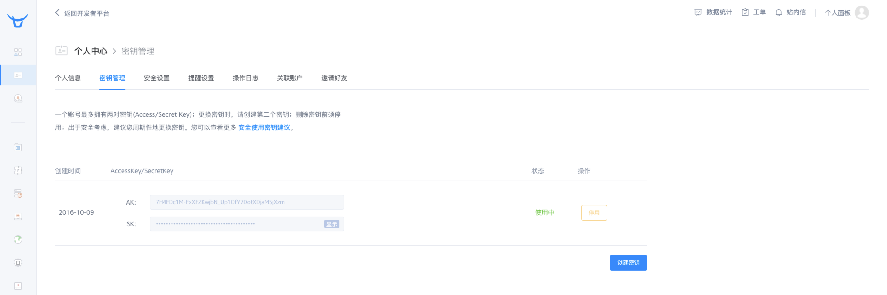
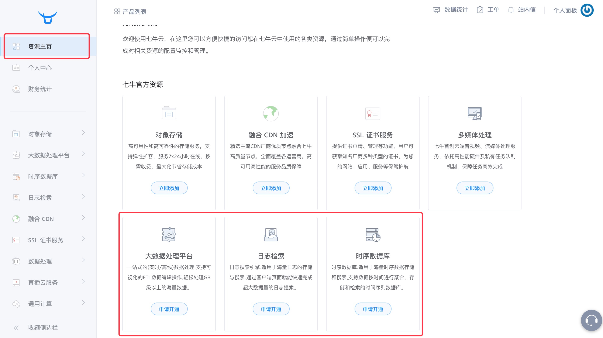

### 使用Pandora的准备工作

在使用Pandora之前，您必须做好以下准备工作：

* 拥有七牛云账号并成功开通Pandora服务；
* 到七牛云官网申请 Access Key 和 Secret Key；

具体操作请参考如下步骤：

(1). 登录七牛云官网 `http://www.qiniu.com`；

(2). 点击 <注册> 弹出七牛云账号注册页面，根据提示完成账号注册。

(3). 使用注册成功的账号和密码登录七牛云官网。（如您已拥有七牛云账号，注册步骤可以省略，直接使用已有的账号登录七牛云官网即可。）

(4). 登录后，点击<个人面板>的秘钥管理页面。

(5). 点击秘钥管理页面的<创建秘钥>按钮，并启用。

(6). 点击<资源主页>按钮，进入产品列表页面，在`流式处理服务`、`日志检索`、`时序数据库`下点击<申请开通>。

(7). 在申请开通页面填写相应信息后，勾选同意《七牛Pandora服务协议》后，点击<提交申请>按钮，然后等待服务审核通过即可。审核完成会以页面以及邮件方式通知。

