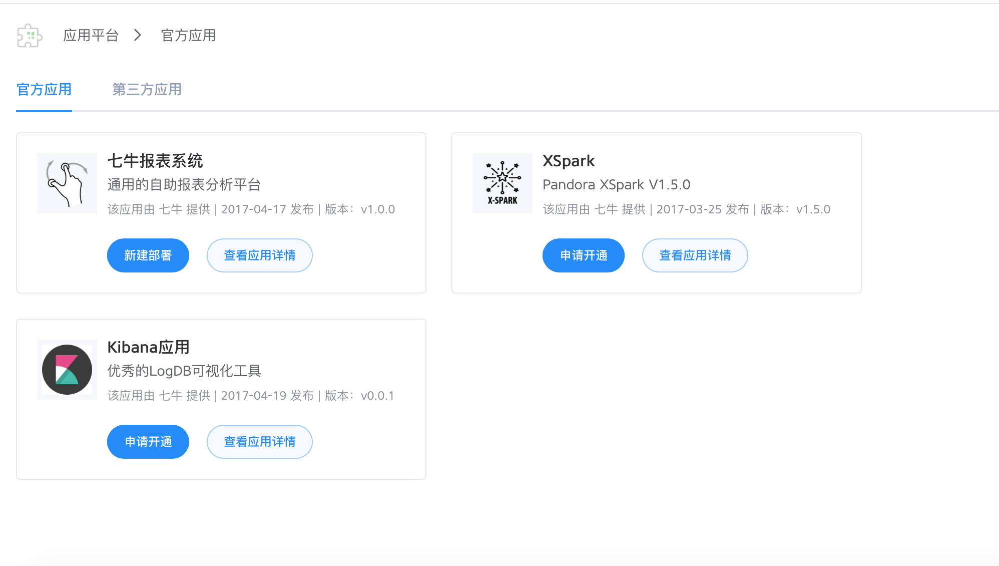
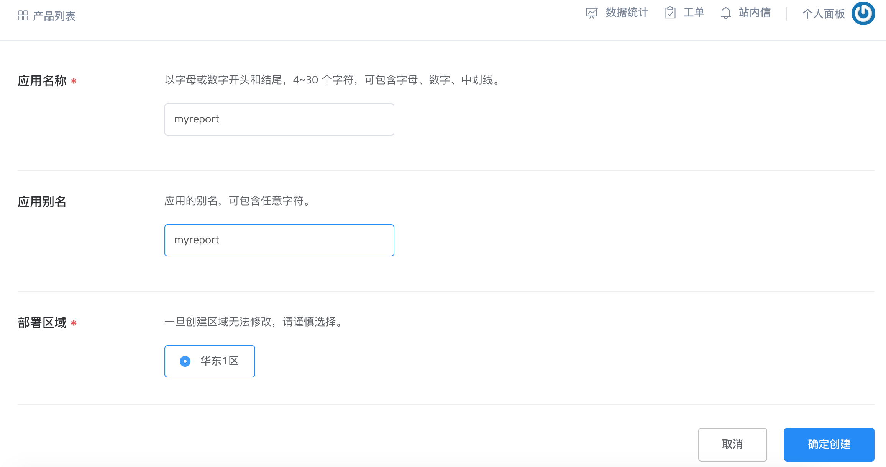

### 简介
Qiniu Report Studio 是七牛通用的自助报表分析平台。支持众多种类的数据源，如：mysql，mongodb等等。平台本身不存储源数据，因此数据更安全。
目前发布在七牛应用市场。

### 创建报表系统

1. 首先登陆七牛portal的应用平台。
2. 点击`新建部署`,填写好名字等等信息，然后确定新建。
3. 创建成功后跳到产品列表,这里可以学习下快速上手指南。
4. 刚进来的时候并没有初始化系统，此时需要你定下`初始化`。

当上面步骤操作完成后，出现下面是监控的界面，这里可以看到系统组件的配置。当我们有新feature发布时，点击`升级`可以无缝滴升级到新版本。

除此之外，监控下方是用户管理模块，管理员可以在这里创建/删除用户，重置密码等基本操作。

到这里你就创建了一个自己的报表系统了。 点击`打开报表Portal`，即可跳转到你的报表系统界面。此时使用刚才创建的用户名/密码登录系统。

### 报表操作指南

Pandora Report 主要分为四部分模块：

1. 数据源管理/数据集
2. 图表分析器
3. 报表仪表展现
4. 模板引擎

#### 创建数据源

**操作步骤**

1. 切换到侧边栏第一项`数据源/数据集`模块，点击右侧的`添加数据源`，按照提示填写数据源信息，然后保存。
2. 点击数据源列表的`编辑`可重新编辑数据源，点击`删除`删除数据源。
3. 点击`加载`可加载数据源的数据表列表。
4. 点击眼状图表可预览数据表信息。
5. 点击`创建数据集`即创建数据集。

#### 创建/制作数据集

数据集核心的两个操作对象是维度和度量。维度一般是普通的分组字段/条件字段，日期字段也属于该范畴，只是日期字段有更多的操作。度量一般是计量字段，能够在上面添加算子是其最核心的特性。

**操作步骤**

1. 在数据源列表里加载数据表后，点击`创建数据集`即可创建数据集。
2. 保存数据集后可加载/预览数据。
3. 展开字段右侧的操作项能够做`重命名`,`转换数据类型`,`添加单位`等等操作。
3. 维度、度量之间可以任意切换。
4. 使用聚合方法，如："求和"，"平均"，"最大"，"最小"，"计数"等。

**注**：对于NoSQL等schema-free数据源，比如mongodb。系统无法获得schema信息，然而你可以通过保存数据集后加载部分数据，此时便可以推断出你数据里可能含有的字段。在显示出来的数据表头的每个字段名左边有添加到左边侧边栏的操作入口，即可完成获取schema的工作。

#### 分析制作图表

分析模块界面上分为两大块：数据查询模块和图表绘制模块。
在左侧的数据查询模块，我们使用字段/操作选择的方式模仿SQL来做数据查询的工作。右侧的图表制作模块使用准备好的数据来绘制图表。

下面分别对两块模块的使用做简要说明：

**数据查询模块**

1. 时间选项选择你要使用哪个字段作为你的时间字段，并且可以指定时间的值的范围。如果不指定也可以，该字段作为后续如果有时间相关操作时的字段依据。
2. 查询部分选择你要查询的维度及度量即可。
3. 条件部分可选，你可以点击添加进行设置条件查询。
4. 分组刷选可选，如果上面指定了维度度量，会自动生成该选项的字段。having作为分组条件查询。
5. 选择完成后点击`查询`，即可查询数据并展开右侧的区域，使用推荐的字段绘制默认图表。

**图表绘制模块**

1. 行/列上选择你要放置的字段。
2. 自定义筛选器，选择你要作为图表联动查询的字段。立即在图表上方生成选择器。
3. 可以切换图表类型，及翻转行/列。
4. 第2步生成的选择器可以重新绘制图表。
5. 最后一步即是保存绘制好的图表。

#### 制作报表

**操作步骤**

1. 展开侧边栏中间的`报表`导航。
2. 创建一个报表也，根据提示跳转到编辑页。
3. 在编辑页，打开左侧的图表列表，拖拽一张图表到右侧的区域，即完成添加一张图表到报表。
4. 点击保存即可保存报表。
5. 如果制作报表的时候觉得图表不是很满意，可以点击图表右上方的编辑，跳转到图表绘制页面重新调整。

#### 模板引擎

模板引擎现在主要提供两个功能点：日报生成和邮件日报。当然这块的用途大有可为，比如我们可以制作特点领域问题的报表模板（如：漏斗分析，用户路径分析等等），用户可以套用模块制作自己的报表。

**操作步骤**

1. 点击`新建模板`，即可创建一份模板。
2. 点击模板名，跳转到报表制作模块，在这里制作你自己想要的报表。
3. 点击`编辑`有日报生成，邮件生成等等规则的设定。
4. 回到模板列表，这里的下拉列表选择你要生成的定时任务规则，并点击右侧的开/关来控制执行。

