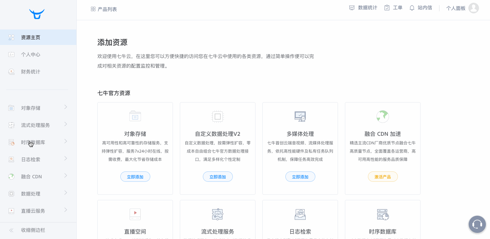

### 创建仓库与序列

**操作流程：**

进入时序数据库服务，点击**创建仓库**按钮，开始创建第一个数据仓库。创建仓库完成后，在`序列`页面点击**创建序列**按钮，开始创建第一个序列。

**数据源/消息队列节点填写参数说明：**

|参数|必填|说明|
|:---|:---|:---|
|仓库名称|是|用来区分其他仓库，唯一标识，用户自行命名|
|所属区域|是|所属区域,计算与存储所使用的物理资源所在区域,目前支持华东区域；</br>此参数是为了降低用户传输数据的成本；应当尽量选择离自己数据源较近的区域|


|参数|必填|说明|
|:---|:---|:---|
|序列名称|是|用来区分其他序列，唯一标识，用户自行命名|
|所属仓库|是|该序列属于哪个数据仓库|
|存储时限|是|数据存储的时限，最小为1天，最大为30天，存储时间超过这个时限的数据，将会被系统自动删除|

**操作演示：**



### 数据查询

**操作流程：**

点击页面左侧的**数据查询**，进入查询页面。

首先我们选择一个数据仓库，然后在SQL编辑框里编写SQL，最后点击数据查询按钮/图表查询按钮即可。

> 提示：
> 
> 1.点击**查询字段信息**下拉列表，选择一个序列，然后点击右侧的Tags/Fileds可以查看这个序列的索引字段和普通字段。
> 
> 2.编写完一条SQL之后，可以点击**保存SQL语句**按钮，将这个SQL语句作为常用SQL，方便操作。

**操作演示：**


### SQL编写规范

我们用一个示例来讲解时序数据库的SQL编写规范以及一些核心的概念。

假设我们现在有一个水位监测的序列（可以理解为一张表），它的名称为`waterLevelInfo`，它所包含的信息如下：

|字段名称|字段类型|属性|备注|
|:----|:----|:----|:----|
|createTime|date| timestamp |数据产生时间，注意，timestamp的内容为RFC 3339 时间戳|
|id|long|filed|设备唯一编号|
|area|string|tags|设备所在区域|
|reach|string|tags|设备所在河段|
|waterLevel|float|filed|目前水位，单位为米|

##### 1.查询所有数据

?>select * from waterLevelInfo

##### 2.查询某个字段的数据

只有属性为`filed`的列才能作为查询主体，`tags`无法单独作为查询主体。

正确的查询：

?>select waterLevel from waterLevelInfo

?>select waterLevel,area from waterLevelInfo

错误的查询：

!>select area from waterLevelInfo

##### 3.对查询主体做函数运算

函数运算同样只能在`filed`字段上，`tags`和`timestamp`只能作为分组和查询条件。

目前时序数据库支持的聚合函数：

```
count
sum:总和
mean:平均值
distinct
bottom(field,N):最小的N个值
top(field,N):最大的N个值
max
min
first:时间戳最新的值
last:时间戳最老的值
difference【不保证精确】
```

正确的查询：

?>select mean(waterLevel) from waterLevelInfo

错误的查询：

!>select count(area) from waterLevelInfo

##### 4.分组

Group By在时序数据库中可以对`tags`和`timestamp`使用。

Group By`timestamp`时，必须拥有where timestamp条件。

正确的查询：

?>select mean(waterLevel) from waterLevelInfo group by area

?>select mean(waterLevel) from waterLevelInfo where time > now() - 3d group by time(5m)

错误的查询：

!>select mean(waterLevel),area from waterLevelInfo group by id

##### 5.排序

Order By在时序数据库中可以对`timestamp`使用。

正确的查询：

?>select mean(waterLevel) from waterLevelInfo order by time desc

错误的查询：

!>select mean(waterLevel),area from waterLevelInfo order by id desc

##### 6.时间作为查询条件

?> select mean(waterLevel),area from waterLevelInfo where createTime > now() - 5m

?> select mean(waterLevel),area from waterLevelInfo where createTime > now() - 3d and createTime > now() - 1d

?> select mean(waterLevel),area from waterLevelInfo where createTime > `'2017-01-01T13:00:00Z'`

!>注意：`now()`表示当前时间， '-'符号的左右两边都必须至少包含一个空格。

> `s`=秒，`m`=分，`h`=小时，`d`=天

### 使用Grafana